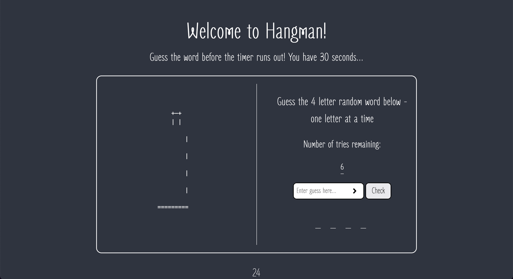

# Hangman Game

This project was a personal challenge of mine - to build a fully functioning Hangman game

## Table of contents

-  [Overview](#overview)
   -  [The challenge](#the-challenge)
   -  [Screenshot](#screenshot)
   -  [Links](#links)
-  [My process](#my-process)
   -  [Built with](#built-with)
   -  [What I learned](#what-i-learned)
   -  [Continued development](#continued-development)
   -  [Useful resources](#useful-resources)
-  [Author](#author)

## Overview

### The challenge

Your users should be able to:

-  Interact with the 'Start Game' button to begin playing the game
-  Enter their letter of choice and recieve correct validation if input is invalid
-  Submit their letter of choice and receive confirmation of whether they guessed correctly
-  The timer should terminate after 30 seconds and prompt the user to restart the game
-  For each incorrect guess, an additional version of the hangman image should be displayed, as well decreasing the number of guesses remaining
-  Each correctly guessed letter should be displayed to the user at its corresponding position in the word

### Screenshot



### Links

-  Live Site URL:

## My process

### Built with

-  Semantic HTML5 markup
-  Flexbox
-  Vanilla JS
-  ES6 Modules

### What I learned

```html
<p id="word-to-guess">
   <span id="letter0">_</span>
   <span id="letter1">_</span>
   <span id="letter2">_</span>
   <span id="letter3">_</span>
</p>
```

I first attempted to reveal the correctly guessed letter within one single `<p>`, before then realising I needed to individually match each letter position with that corresponding letter's index value in the 'selected word' array. I was proud of my ability to semantically produce this solution inside a `<p>` wrapper, using `<span>` tags which wouldn't add any more unnecessary semantic meaning to the words' markup.

```html
<pre id="hangman-img" class="hangman">
      +—+
      | |
   
         |
   
         |
   
         |
   
         |
   
   =========
</pre>
```

This project was my first time using the `<pre>` tag in action which, although is clearly powerful in displaying whatever string you present it with, also presents a major issue in controlling the alignment of the data. In the future, it would be better to use images of each hangman position which could then be controlled much easier within the CSS so they would change at the same point to achieve a level of uniformity.

```css
.error-icon {
   background: url('/images/exclamation-solid.svg') no-repeat 90% center / 4%;
}
```

To add to the visual representation of invalid inputted data, I decided to practice dynamically toggling different background icons from an error class which was applied to the input. For future projects, I feel using a fixed px value for the positioning could help with controlling the icon's position if other content around it were to responsively adjust.

```js
   timerBegin: () => setInterval(timerCount, 1000),
   timerEnd: () => clearInterval(finish),
```

In order to build the restricted timer logic, I had to first setup the timer using the built in asynchronous function `setInterval()`, whilst further learning how to cancel it appropiately based on specific events occuring. This callback function will probably end up being more useful than `setTimeout()`, but I will need to research how to account for 'browser teething' issues, that cause the function to run at an increasingly delayed time compared to the amount you manually set.

```js
const random = () => Math.floor(Math.random() * 9) + 1
const word = words[random()]
functions.element(guess, 'value', '')
return word.split('')
```

This small block of code performed an important amount of logic in a relatively refactored manner, considering the level I am currently at in learning JavaScript. I was proud of my ability to run the `random()` function inside the array selection syntax, as well as making use of the `split()` method to return that word in the desired format.

```js
if (isPlaying) {
   const regex = /[a-z]/g
   if (
      regex.test(val) &&
      val.length === 1 &&
      !correctGuesses.includes(val)
         ) {...}
}
```

Once again, I was really proud of the above code because it utilises a lot of efficient logic and techniques which I had only recently learnt in my JavaScript journey. The `isPlaying` variable uses the traditional 'is' naming convention when some form of funcion or logic is returning a value based on some form of boolean logic. Although I had already used regular expressions before this project, I was glad I was able to create one on the fly for this purpose without needing to conduct any research.

### Continued development

In regards to storing the words which were used in the game, I chose to hardcode them into an array manually to test if my random number selection logic worked. However, in the future I realise you would pull this kind of data from an external API, which could therefore be much more dynamic in creating different topics and word lengths.

I kept track of the game's 'state' through multiple number variables in the global scope, which in the future I will try to refactor by potentially using an object to store all of them, or reverse their individual logic for multiple purposes (if one increases, then the other should decrease).

### Useful resources

-  [Pig Game Project](https://www.udemy.com/course/the-complete-javascript-course/) - Completing this game in advance really helped me with a lot of the base logic for games, such as only executing the game via boolean logic which determines if it is currently being played, or if the user has pressed the 'start' button.

-  [JavaScript - ES6 Modules](https://www.youtube.com/watch?v=cRHQNNcYf6s&t=283s&ab_channel=WebDevSimplified) - Kyle's quick crash course like tutorial helped me quickly get up to speed with Modules in JavaScript, focusing on the theory behind how they work and the difference between default and named imports.

## Author

-  Website - [Joshua Jameson-Wallis](https://joshuajamesonwallis.com)
-  Linkedin - [Joshua Jameson-Wallis](https://www.linkedin.com/in/joshua-jameson-wallis/)
